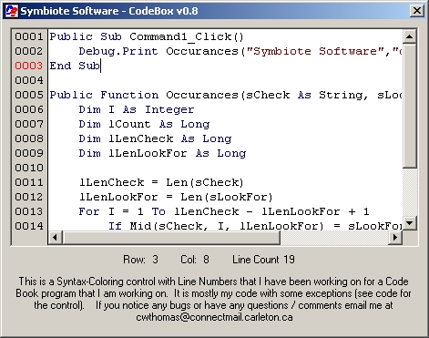

## CodeBox v0\.8

### Description

Syntax Highlighter with linenumbers. Also has the ability to load syntax and colors at runtime, which makes it great for multi-language code books.

## EDIT ##

I managed to get the tabs to work nicely using Paul Caton's Keyboard Hook (http://www.Planet-Source-Code.com/vb/scripts/ShowCode.asp?txtCodeId=42918&lngWId=1)

For the next version I am looking to have Undo/Redo capabilities.
 
### More Info
 

             |
---                |---
**Submitted On**   |2003-03-13 19:33:22
**By**             |[Chris Thomas](https://github.com/Planet-Source-Code/PSCIndex/blob/master/ByAuthor/chris-thomas.md)
**Level**          |Advanced
**User Rating**    |4.2 (38 globes from 9 users)
**Compatibility**  |VB 6\.0
**Category**       |[Custom Controls/ Forms/  Menus](https://github.com/Planet-Source-Code/PSCIndex/blob/master/ByCategory/custom-controls-forms-menus__1-4.md)
**World**          |[Visual Basic](https://github.com/Planet-Source-Code/PSCIndex/blob/master/ByWorld/visual-basic.md)
**Archive File**   |[CodeBox\_v01558843132003\.zip](https://github.com/Planet-Source-Code/chris-thomas-codebox-v0-8__1-43966/archive/master.zip)

